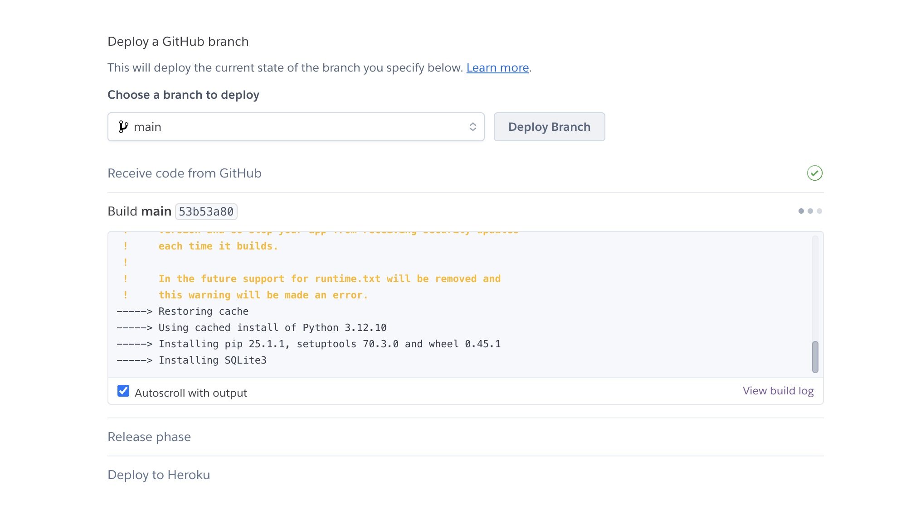

# Deployment

- The  Riders-Club-Project was deployed to [www.heroku.com](www.heroku.com)

## Local deployment

*Note:*
  - This project requires to install all the requirements:
  - Open the terminal window and type:
  - `pip3 install -r requirements.txt`

*During the development stage DEBUG is set to True, in settings.py file but it is vital to change it to False in the production stage.*

Create a local copy of the GitHub repository by following one of the two processes below:

- Download ZIP file:
  1. Go to the [GitHub Repo page](https://github.com/Eyongtarh/Riders-Club-Project.git).
  1. Click the Code button and download the ZIP file containing the project.
  1. Extract the ZIP file to a location on your PC.

- Clone the repository:
  1. Open a folder on your computer with the terminal.
  1. Run the following command
  - `git clone https://github.com/Eyongtarh/Riders-Club-Project.git`

---

1. Install the dependencies:

    - Open the terminal window and type:
    - `pip3 install -r requirements.txt`


1. Create a `.gitignore` file in the root directory of the project where you should add env.py and __pycache__ files to prevent the privacy of your secret data.

1. Create a `.env` file. This will contain the following environment variables:

    ```python
    import os

      os.environ['SECRET_KEY'] = 'Add a secret key'
      os.environ['DATABASE_URL'] = 'will be used to connect to the database'


1. Run the following commands in a terminal to make migrations: 
    - `python3 manage.py makemigrations`
    - `python3 manage.py migrate`
1. Create a superuser to get access to the admin environment.
    - `python3 manage.py createsuperuser`
    - Enter the required information (your username, email and password).
1. Run the app with the following command in the terminal:
    - `python3 manage.py runserver`
1. Open the link provided in a browser to see the app.

1. If you need to access the admin page:
    - Add /admin/ to the link provided.
    - Enter your username and password (for the superuser that you have created before).
    - You will be redirected to the admin page.


## Heroku Deployment

* Set up a local workspace on your computer for Heroku:
    - Create a list of requirements that the project needs to run:
      - type this in the terminal: `pip3 freeze > requirements.txt`
    - Commit and push the changes to GitHub
    
* Go to [www.heroku.com](www.heroku.com) 
* Log in or create a Heroku account.
* Create a new app with any unique name <name app>.

  

* Create a Procfile in your local workplace:

  
    
    This file will will contain the following:
    ```python
        web: gunicorn <name app>.wsgi:application
    ```
    - Commit and push the changes to GitHub.


* Go to the settings app in Heroku and go to Config Vars.

Click on Reveal Config Vars and add the following config variables:

| Key      | Value          |
|-------------|-------------|
| DATABASE_URL | ... | 
| DISABLE_COLLECTSTATIC | 1 |
| SECRET_KEY | ... |

* Copy the value of DATABASE_URL and input it into the .env file and generate a secret key.
* Migrate changes.
* Set debug to False in settings.py
* Commit and push the changes to GitHub.
* Connect your repository to Heroku.

  

* Deploy the app to Heroku by clicking "Deploy Branch" button. If you want to enable auto-deployment, click "Enable Automatic Deployment".

   


The deployment process will start.

   

Click "View build logs" to see the progress of the deployment.

  


**Final Deployment**

* Set debug to False locally + delete DISABLE_COLLECTSTATIC from config vars in Heroku dashboard.
* Commit and push the changes to GitHub.
