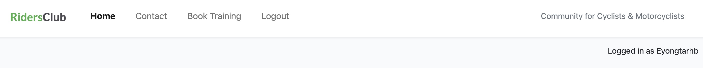
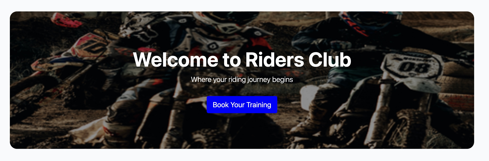
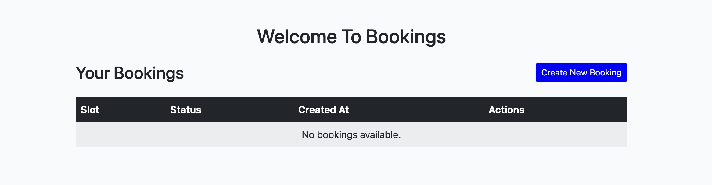

# Riders-Club-Project

## Features

Website has the following pages:
- Home Page
- Contact Page
- Book Training Page
- Login Page
- Logout Page
- Registration Page
- Create New Booking Page
- Bookings Details Page
- Update Booking Page
- Confirm Delete Booking Page
- Success Page
- Error Pages

### Pages:

Each page has a navbar and a footer

#### Navbar

1 Navbar has the following links with logout:

- Home page.
- Contact page.
- Book Training page.
- Registration page.
- Login page.
- A title name: RidersClub
- It also has a statement: community for cyclists and motorcyclists, and a message display below it: Not logged in

2 Navbar has the following links with login:

- Home page.
- Contact page.
- Book Training page.
- Logout page.
- A title name: RidersClub
- It also has a statement: community for cyclists and motorcyclists, and a message display below it: logged in as (Username).

3 Navbar has the Hamburger Menu on mobile devices:

- Navbar Hamburger Menu With login

- Navbar Hamburger Menu With logout

#### Footer

Footer has the following sections:

- About RidersClub in first place.

- Quick Links in the second place.

- Social Medial links in the third place.

- Footer bottom which is below the above three sections, houses the copyright statement.

For mobile devices, the footer looks like Viz:

#### Home Page

The Home page consist of a hero section, features section, gallery section and testimonials.

##### Hero Section

This section has a welcome message and a button "Book Training" at the center which leads to the book training page. Under the hero 

section, there is a section, which describes the features of the Riders Club.

##### Features Section

This section has 3 images in 3 parts displayed in a row, with a title, and a description at the top for all. The first image is a race cyclist, the second image is a city cyclist with a child behind the loader, and the third image is a motorcyclist.

On the mobile version, the sections are displayed in a column.

##### Gallery Section

This section has 3 parts displayed in a row, each with an icon, a title, and a description.

On the mobile version, the sections are displayed in a column.

##### Testimonials Section

The section is the testimony of two users with their ratings.

#### Contact Page

 The Home page consist of a hero section, features section, gallery section and testimonials.

##### Contact Information Section

This section has two sections, first section contains a welcome message and second section contains address(email, telephone, and postal address) and location google map in an iframe. 

On the mobile version, the sections are displayed in a column.

##### Business Hours Section

This section contains working days and opening and clossing hours. It is displayed in a row, with a title, and a description at the top.

On the mobile version, the sections is displayed in same way; centered.

##### Contact Form Section

This section is a contact form with required entries of name, email, and message. A submit button is below and a successful message will display if positive , otherwise a failed message will display indicating what to fix.

On the mobile version, the section is displayed in same way.

##### FAQ Section

The section is the testimony of two users with their ratings.

On the mobile version, the section is displayed in same way.

#### Book Training Page

 The book training page consist of a welcome page header message , section header message; your bookings and a button to create new bookings. Below is a table showing all user bookings illustrated by slot, status, created at, action. Under action, user is able to see booking details, update booking, and delete booking. Below the table, pagination is displayed when there is pagination.

 Book training page when there are no bookings.

Book training page when there are bookings.

On the mobile version, the booking table section is scrollable.

### Login Page

Login Page has a white background with a login form, which has a header including a "signup" button if user is not registered. The login form includes input fields for the user to fill in. Plus it has a button "Sign In".

On the mobile version, the page is displayed as viz:

### Logout Page

This page has a white background with a logout form with a header and a button "Logout" leading to the home page.

On the mobile version, the page is displayed as viz:

### Registration Page

This page has a white background with a registration form, which has a header including a "signin" button if user is already registered. The form includes input fields for the user to fill in user name, optional email, password and password again. Plus it has a button "Sign Up".

On the mobile version, the page is displayed as viz:

### Create New Booking Page

This page has a link in the book training page, when clicked, it leads to the create new booking page. The page has a header and includes input fields for the user to fill in slot(required), optional notes, and status(required). It has a button at the bottom: "Create New Booking". 

If succesful, a booking is created and leads you to the booking training page and a succesful message will display. If unsuccesful, an error message will display and equally gives you an explanation of what is wrong. For example as viz:

On the mobile version, the page is displayed as viz:

### Bookings Details Page

This page has a button link in the "book training page" as "Detail" for each booked slot. When clicked, it leads to the "Bookings Details Page". The page has a header and displays booked date, time, location, and status(pending, confirmed, or cancelled). It equally has 3 buttons at the bottom which are: "Update"; leads to update booking page, "Delete"; leads to delete booking page, and  "Book Training" leads to book training page. 

On the mobile version, the page is displayed as viz:

### Update Booking Page

This page has a button link in the book training page as "Detail" for each booked slot, when clicked, it leads to the "Bookings Details Page". The page has a header and includes input fields for the user to fill in slot(required), optional notes, and status(required). It has a button at the bottom: "Create New Booking". 

  

It has a container where the user can edit:

- First Name;
- Last Name;
- Phone Number;

There are three fields with prefilled data for the user. The user could change this data if he/she wants.

  

Underneath the fields, there are two buttons, "Go Back" and "Save." If the user doesn't want to save changes, they can click on the "Go Back" button and will be redirected to the profile page. If the user wants to save changes, they can click on the "Save" button and will be redirected to the profile page.

  

**Profile Delete Page**

  

Only the bosses have access to this page as only they are able to delete any profile.

This page has a box with a warning message and a link to the profile page of the user that is about to be deleted:

  

There are two buttons under the warning message, there are two buttons, "Cancel" and "Delete". If the user doesn't want to delete the profile, he/she can click on the "Cancel" button and will be redirected to the profile page. If the user wants to delete the profile, he/she can click on the "Delete" button and will be redirected to the profile page, and the school member will be permanently deleted.

  

**Profile Change Password Page**

  

It has a header with the title "Change Password" and a subtitle to guide the user on what to do next. Underneath, there are three field to be filled:

- Old Password;
- New Password;
- Confirm New Password.

  

If there are any errors in the fields, the user will see the error message.

Under the fields, there are two buttons, "Go Back" and "Submit". If the user doesn't want to change the password, he/she can click on the "Go Back" button and will be redirected to the profile page. If the user wants to change the password, he/she can click on the "Change Password" button and will be redirected to the profile page, and the password will be changed if all conditions are met.

  

**New Applications Page**

This page is only visible to the boss and sales manager.
  

This page has a title and the number of the new applications left.

  

It also has a table with the new applications, where each application has a link. After clicking on the application in a table, the user will be redirected to the application detail page.

  

Underneath the table, there are navigation buttons. If the user wants to see the next page of the application, he/she can click on the "Next" button. If the user wants to see the previous page of the applications, he/she can click on the "Previous" button.

  
  

**Application Detail Page**

This page is accessible to the boss and sales manager.
For the boss, the page has the following look:

  

It has two boxes. The first box consists of the information about the applicant, including the name, the email, and the phone number.

  

It also has a "Delete" button in the top right corner of the page. If the boss wants to delete the application, he/she can click on the "Delete" button and will be redirected to the delete application page.

  

The second box provides the boss with the assigning role functionality, which will give access to the applicant to the application according to the role the boss assigns.

  

When the boss clicks on the dropdown menu, the following choices will be shown:

  

After choosing the role the boss wants to assign, he/she can click on the "Save" button.

  

When the boss clicks on "Save" button, the role will be assigned to the applicant. However, it will not redirect the boss to any page in order to prevent the boss from accidentally assigning the wrong role to an applicant.

To go back to the applications page, the boss may click on the link underneath the boxes "Go to other applications". And the user will be redirected to the applications page.

  

For the sales manager, the page has the following look:

  

The page has no "Delete" button as it is not accessible to the sales manager. Moreover, the page has no box with the assigning role to the new applicant as it is accessible only to the boss.

**Application Delete Page**

  

This page is only accessible to the boss. Thus, only the boss is empowered to delete any applications.
It has a warning message with the applicant's name.

  

It also has 2 buttons, "Go Back" and "Delete". If the boss doesn't want to delete the application, he/she can click on "Go Back" button and will be redirected to the application detail page. If the boss wants to delete the application, he/she can click on "Delete" button. He / she will be redirected to the new applications page, and the application will be permanently deleted.

  

**Limited Access Page**

  

This page applies to the users that are not allowed to access the page that they want to enter manually in the address bar. it has a box with a friendly message pointing out that the user has no access to a particular page. It also has a link to the user's profile page.

  

**Error Pages**

There are also 2 additional error pages:

  

  it has a box with the header "Page 404", an image and a short message about the error ("Something went wrong as this page is not found").

  If the user is logged in and tries to access a page that doesn't exist, he/she will find a button with the link to his/her profile page.

  

  If the user is logged out and tries to access a page that doesn't exist, he/she will find a button with the link to the home page

  

  Page 505 is the same as 404 page, but it has a different header ("Page 500") and message ("Something went wrong as there is an internal sever error!").

  

**Favicon**

  

  The favicon is a small image that is displayed in the browser's address bar. It is used to identify the website among others and help the user to find it when he/she is searching for it.

[Back to contents](#contents)

---