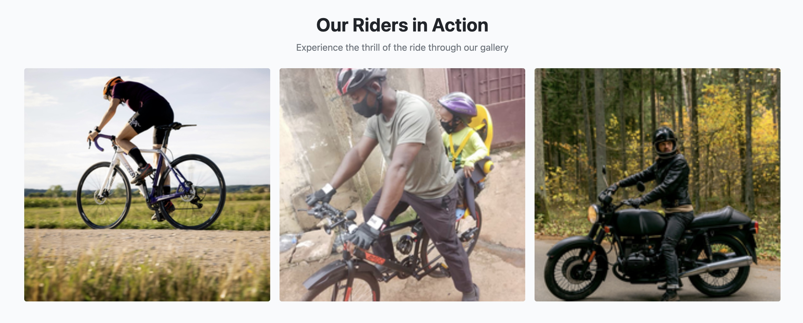

# Riders-Club-Project

## Features

Website has the following pages:
- Home Page
- Contact Page
- Book Training Page
- Login Page
- Logout Page
- Registration Page
- Create New Booking Page
- Bookings Details Page
- Update Booking Page
- Confirm Deletion Page
- Contact Form Success Page
- Error Pages

### Pages:

Each page has a navbar and a footer

#### Navbar

1 Navbar has the following links with logout:

- Home page.
- Contact page.
- Book Training page.
- Registration page.
- Login page.
- A title name: RidersClub
- It also has a statement: community for cyclists and motorcyclists, and a message display below it: Not logged in

2 Navbar has the following links with login:

- Home page.
- Contact page.
- Book Training page.
- Logout page.
- A title name: RidersClub
- It also has a statement: community for cyclists and motorcyclists, and a message display below it: logged in as (Username).

3 Navbar has the Hamburger Menu on mobile devices:

- Navbar Hamburger Menu With login

- Navbar Hamburger Menu With logout

#### Footer

Footer has the following sections:

- About RidersClub in first place.

- Quick Links in the second place.

- Social Medial links in the third place.

- Footer bottom which is below the above three sections, houses the copyright statement.

For mobile devices, the footer looks like Viz:

#### Home Page

The Home page consist of a hero section, features section, gallery section and testimonials.

##### Hero Section

This section has a welcome message and a button "Book Training" at the center which leads to the book training page. Under the hero 

section, there is a section, which describes the features of the Riders Club.

##### Features Section

This section has 3 images in 3 parts displayed in a row, with a title, and a description at the top for all. The first image is a race cyclist, the second image is a city cyclist with a child behind the loader, and the third image is a motorcyclist.

On the mobile version, the sections are displayed in a column.

##### Gallery Section

This section has 3 parts displayed in a row, each with an icon, a title, and a description.

On the mobile version, the sections are displayed in a column.

##### Testimonials Section

The section is the testimony of two users with their ratings.

#### Contact Page

 The Home page consist of a hero section, features section, gallery section and testimonials.

##### Contact Information Section

This section has two sections, first section contains a welcome message and second section contains address(email, telephone, and postal address) and location google map in an iframe. 

On the mobile version, the sections are displayed in a column.

##### Business Hours Section

This section contains working days and opening and clossing hours. It is displayed in a row, with a title, and a description at the top.

On the mobile version, the sections is displayed in same way; centered.

##### Contact Form Section

This section is a contact form with required entries of name, email, and message. A submit button is below and a successful message will display if positive , otherwise a failed message will display indicating what to fix.

On the mobile version, the section is displayed in same way.

##### FAQ Section

The section is the testimony of two users with their ratings.

On the mobile version, the section is displayed in same way.

#### Book Training Page

 The book training page consist of a welcome page header message , section header message; your bookings and a button to create new bookings. Below is a table showing all user bookings illustrated by slot, status, created at, action. Under action, user is able to see booking details, update booking, and delete booking. Below the table, pagination is displayed when there is pagination.

 Book training page when there are no bookings.

Book training page when there are bookings.

On the mobile version, the booking table section is scrollable.

### Login Page

Login Page has a white background with a login form, which has a header including a "signup" button if user is not registered. The login form includes input fields for the user to fill in. Plus it has a button "Sign In".

On the mobile version, the page is displayed as viz:

### Logout Page

This page has a white background with a logout form with a header and a button "Logout" leading to the home page.

On the mobile version, the page is displayed as viz:

### Registration Page

This page has a white background with a registration form, which has a header including a "signin" button if user is already registered. The form includes input fields for the user to fill in user name, optional email, password and password again. Plus it has a button "Sign Up".

On the mobile version, the page is displayed as viz:

### Create New Booking Page

This page has a link in the book training page, when clicked, it leads to the create new booking page. The page has a header and includes input fields for the user to fill in slot(required), optional notes, and status(required). It has a button at the bottom: "Create New Booking". 

If succesful, a booking is created and leads you to the booking training page and a succesful message will display. If unsuccesful, an error message will display and equally gives you an explanation of what is wrong. For example as viz:

On the mobile version, the page is displayed as viz:

### Bookings Details Page

This page has a button link in the "book training page" as "Detail" for each booked slot. When clicked, it leads to the "Bookings Details Page". The page has a header and displays booked date, time, location, and status(pending, confirmed, or cancelled). 

It equally has 3 buttons at the bottom which are: "Update"; leads to update booking page, "Delete"; leads to delete booking page, and  "Book Training" leads to book training page. 

On the mobile version, the page is displayed as viz:

### Update Booking Page

This page has a link in the book training page for each booking. When clicked, it leads to the update booking page. The page has a header and includes input fields for the user to edit whic are: slot(required), optional notes, and status(required). 

It has two buttons at the bottom: "Update Booking" button; which updates the booking and leads to "Book Training page" and "Cancel" button; which leads to "Book Training page".

On the mobile version, the page is displayed as viz:

### Confirm Deletion Page

This page has a link in the book training page for each booking as "Delete". When clicked, it leads to the "Confirm Deletion Page". The page has a header and includes the slot's booking date, time, place, status, notes, and date/time created.

It has two buttons at the bottom: "Yes, Delete it" button; which deletes the booking and leads to "Book Training page" and "Cancel" button; which leads to "Book Training page".

On the mobile version, the page is displayed as viz:

### Contact Form Success Page

This page displays when a contact form in the contact page is submitted succesfully. It displays a thank you message and assures you of a reply.

On the mobile version, the page is displayed as viz:

### Error Pages

There are 2 additional error pages:

  it has a box with the header "404 - Page Not Found", an image and a short message about the error ("The page you're looking for doesn't exist or may have been moved").

  If the user is logged in and tries to access a page that doesn't exist, he/she will find a button with the link to his/her Book Training page.

  

  If the user is logged out and tries to access a page that doesn't exist, he/she will find a button with the link to the home page

  

  Page 505 is the same as 404 page, but it has a different header ("500 - Internal Server Error") and message ("Something went wrong due to an internal server error").

  

### Favicon

  

  The favicon is a small image displayed in the browser's address bar. It identifies the website amongst others.

[Back to contents](#contents)

---