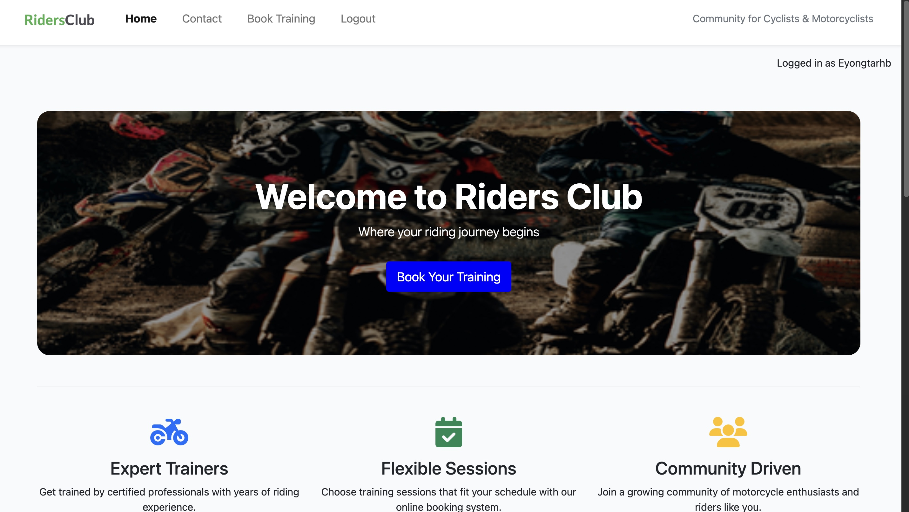

# Testing

## Manual Testing

Testing was done throughout site development, for each feature before it was merged into the main file.

Usability was tested with the below user acceptance testing, sent to new users to ensure testing from different users, on different devices and browsers to ensure issues were caught and where possible fixed during development.

|     | User Actions           | Expected Results | Y/N | Comments    |
|-------------|------------------------|------------------|------|-------------|
| Sign Up     |                        |                  |      |             |
| 1           | Click on the Register link,on mobile devices, click Hamburger Icon then click Register| Redirection to Sign Up page: Login and SignUp | Y |          |
| 2           | Click on the Login button in Sign Up page | Redirection to Login page | Y |          |
| 3           | Enter valid email(optional)| Field will only accept email address format | Y |          |
| 4           | Enter valid username | Field will only accept no more than 150 characters | Y |          |
| 5          | Enter valid password | Field will only accept secure passwords | Y |          |
| 6          | Enter valid password again | Field will only accept the same password from the previous field | Y |          |
| 7          | Click on the Sign Up button | Takes user to Home page confirming successful sign up.| Y |          |
| 8          | Sign In with the same username and password | Takes user Home page confirming successful sign in.  | Y |          |
| 9          | Click Logout button on link, on mobile devices, click Hamburger Icon then click logout button| Takes user to log out page to confirm logout | Y |          |
| 10          | Click "Logout" button  in the page| Redirects user to home page | Y |          |
| 11          | Click browser back button | You are still logged out | Y |          |
| Log In      |                        |                  |      |             |
| 1           | Click on the log in link, on mobile devices, click Hamburger Icon then click log in | Redirection to Sign in page: SignUp and Sign in| Y |          |
| 2           | Click on the SignUp link in the form | Redirection to SignUp page | Y |          |
| 3           | Enter valid username | Field will only accept registerd username | Y |          |
| 4           | Enter valid password | Field will only accept secure passwords | Y |          |
| 5           | Click on the Sign In button | Takes user to home page with pop-up confirming successful sign in. Register link now missing in main nav, replaced by Logout | Y |          |
| 6           | Click "Logout" link, on mobile devices, click Hamburger Icon then click logout| Takes user to log out page to confirm logout | Y |          |
| 7           | Click "Logout" button  in the page| Redirects user to home page | Y |          |
| 8          | Click browser back button | You are still logged out | Y |          |
| Home        |                        |                  |      |             |
| 1           | Click on the "Book Your Training" button at the center of the home page banner| Redirection to Training page | Y | Available to everyone |
| 2           | Click on RidersClub in navbar | Redirection to Home page | Y | Available to everyone |
| 3           | Click browser back button | Redirection to Home page | Y | Available to everyone |
| Contact     |            |                  |      |             |
| 1           |  Click Contact link, on mobile devices, click Hamburger Icon then click Contact | Redirection to contact page | Y | Available only to everyone  |
| 2           |  Fill form and Click submit | Redirect to success message page | Y |  Available to everyone  |
| Book Training        |     |      |     |    |
| 1           |  Click "Book Training" link, on mobile devices, click Hamburger Icon then click Book Training linkj | Redirection to Book Training Page | Y | Available only to logged in users|
| 2           |  Click "Create New Booking" button in the Book Training page| Redirection to Creat New Booking page| Y | Available only to logged in users |
| 3           |  Click on create new Booking after filling the form | Redirection to Book Training page and success messaeg for new booking created| Y | Available only to logged in users |
| 4           |  Click "cancel" button in the create new booking page | Redirection to Book Training page | Y | Available only to logged in users |
|Bookin Details       |     |      |     |    |
| 1           |  Click "Detail" in the newly created booking table in the booking page| Redirection to Boking Details page| Y | Available only to logged in users|
| 2          |  Click "Update" button in the booking details page | Redirection to update buttons page| Y | Available only to logged in users |
| 3          |  Click "Delete" button in the Booking Details page | redirected to Confirm Deletion page | Y | Available only to logged in users |
| 4          |  Click "Book Training" button in the Booking Details page| Redirection to book training page | Y | Available only to logged in users |
|Update Booking       |     |      |     |      |
| 1          |  Click "Update" button in the newly created booking table in the booking page | Redirection to update booking page| Y | Available only to logged in users|
| 2          |  Click "Update Booking" button in the update booking page with/without making updates | Redirection to book training page | Y | Available only to logged in users|
| 3          |  Click "cancel" button in the update booking page | updates booking and redirection to book training page | Y | Available only to logged in users|
|Delete Booking       |     |      |     |      |
| 1           |  Click "Delete" button in the newly created booking table in the booking page| Redirection to confirm deletion page | Y | Available only to logged in users |
| 2           |  Click "cancel" button in the confirm deletion page | Redirection back to book training page | Y | Available only to logged in users |
| 3           |  Click "Yes, delete it" button in the confirm deletion page | deletes booking and redirection to book training page| Available only to logged in users  |

| what|            |                  |      |             |
| 1           |  Change the form data for the first name, last name, or phone number | Date in the form will be updated | Y | Available only when the user opens his/her own profile  |
| 2           |  Click "cancel" button | Redirect back to user profile | Y |  Available only when the user opens his/her own profile |

---

## Testing User Story

| Site Developer Goals   | Requirement met | Image |
| ------------------------- | --------------- | ----- |
| As a site developer, I want to set up both development and production environments, so that I can build and deploy a reliable Riders club website. | Website is reliable. |  |

| Site User Goals    | Requirement met | Image |
| ------------------------- | --------------- | ----- |
| As a site user, I want to register and log in to an account so that I can book club training sessions. | User can register, login and book training |  |
| As a logged-in site user, I want to create, view detail, update, and delete my booked trainings so that I can manage my training schedule effectively. | Manage booked training is working|  |
| As a site user, I want to fill out and submit a contact form to express my interest in collaborating with the club, So that the club can review my request and get in touch with me for further communication. | Contact form is working |  |

| Site Owner's Goals   | Requirement met | Image |
| ------------------------- | --------------- | ----- |
| As a site owner I can update home page so that I can make users to better understand the purpose of the club. | Update is working|  |
| As a site owner I can add information to contact page so that I can make it easier for users to reach site owner. | Update is working |  |

---

## Bugs

### Known bugs

There is no known bug.

### Solved bugs

There were many bugs during the development and production process and some times, I just reset the database.

However, they were a few significant bugs:

- Bug: I mistakenly capitalised the first letter of one of my html files(Booking_detail.html). But the other links for same file was not first letter capitalised. It worked well without errors on windows browser but raised error on safari browser. The error was not fixed by changing the capitalised letter to a small letter.

Solution: I changed all related file links to capitalised first letter.

- Bug: 

---

## Validation:
### HTML Validation:

- [Full HTML Validation Report](documentation/validation/html_validation.pdf)

- No errors or warnings were found when passing through the official [W3C](https://validator.w3.org/) validator. This checking was done manually by copying the view page source code and pasting it into the validator.

### CSS Validation:

- [Full CSS Validation Report](documentation/validation/css_validation.png)

- No errors or warnings were found when passing through the official [W3C (Jigsaw)](https://jigsaw.w3.org/css-validator/#validate_by_uri) validator except for the warnings about the use of css root variables and webkits for the box-shadow. However, css code works perfectly on various devices.

### Python Validation:

- [Full Python Validation Report](documentation/validation/python_validation.pdf)

- No errors were found when the code was passed through Valentin Bryukhanov's [online validation tool](http://pep8online.com/). According to the reports, the code is [Pep 8-compliant](https://legacy.python.org/dev/peps/pep-0008/). This checking was done manually by copying python code and pasting it into the validator.

---
## Lighthouse Report

### Home Page

### Login Page

### Logout Page

### Forgot Password Page

### Access Limited Page

### New Applications Page

### New Application Detail Page

### Application Detail Page

### Members Page

### Profile Page

### Profile Edit Page

### Profile Edit Password Page

### Profile Delete Page

### Students Page

### Student Detail Page

### Student Edit Page

### Student Delete Page

### Sales Page

### Sale Edit Page

### Sale Delete Page

### Sale Add Page

### Schedule Page

### Add Lesson Page

### Edit Lesson Page

### Delete Lesson Page

### Lesson Detail Page

---

## Compatibility

Testing was conducted on the following browsers;

- Safari;
- Chrome;
- Firefox;

[Compatibility Report](documentation/compatibility/compatibility.pdf)

---

# Responsiveness

The responsiveness was checked manually by using devtools (Chrome) throughout the whole development. It was also checked with [Responsive Viewer](https://chrome.google.com/webstore/detail/responsive-viewer/inmopeiepgfljkpkidclfgbgbmfcennb/related?hl=en) Chrome extension.

[Responsiveness Report](documentation/responsiveness/responsiveness.pdf)

---